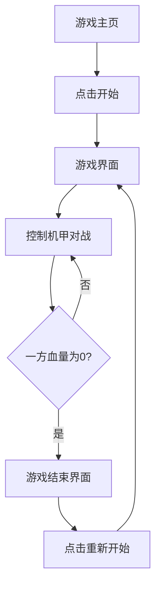

## 1. Product Overview
像素风机甲对战小游戏是一款基于浏览器的2D对战游戏，玩家可以控制机甲进行战斗。
- 游戏面向休闲玩家，提供简单易上手的机甲对战体验
- 通过复古像素风格和流畅的战斗动画，营造怀旧游戏氛围

## 2. Core Features

### 2.1 User Roles
| 角色 | 注册方式 | 核心权限 |
|------|---------------------|------------------|
| 玩家 | 无需注册 | 控制机甲进行对战 |

### 2.2 Feature Module
1. **游戏主页**：游戏标题、开始按钮、操作说明
2. **游戏界面**：机甲对战场景、控制面板、游戏状态显示
3. **游戏结束界面**：胜负结果、重新开始按钮

### 2.3 Page Details
| 页面名称 | 模块名称 | 功能描述 |
|-----------|-------------|---------------------|
| 游戏主页 | 标题区 | 显示游戏名称和像素风格背景 |
| 游戏主页 | 开始按钮 | 点击进入游戏界面 |
| 游戏主页 | 操作说明 | 显示游戏操作方式 |
| 游戏界面 | 对战场景 | 显示机甲、背景和战斗效果 |
| 游戏界面 | 控制面板 | 提供移动、攻击、防御按钮 |
| 游戏界面 | 游戏状态 | 显示双方机甲血量、游戏时间 |
| 游戏结束界面 | 结果显示 | 显示胜负结果和得分 |
| 游戏结束界面 | 重新开始 | 点击重新开始游戏 |

## 3. Core Process
游戏流程：玩家进入游戏主页 → 点击开始按钮 → 进入游戏界面 → 控制机甲进行对战 → 一方血量为0时游戏结束 → 显示游戏结束界面 → 选择重新开始

## 4. User Interface Design
### 4.1 Design Style
- 主色调：深蓝色 (#1a2b3c) 和亮橙色 (#ff7f00)
- 按钮风格：像素风格，带有轻微的3D效果
- 字体：像素字体，如 'Press Start 2P'
- 布局风格：居中布局，复古游戏界面风格
- 图标风格：像素风格图标，简洁明了

### 4.2 Page Design Overview
| 页面名称 | 模块名称 | UI元素 |
|-----------|-------------|-------------|
| 游戏主页 | 标题区 | 大号像素字体标题，背景为像素风格机甲图案 |
| 游戏主页 | 开始按钮 | 像素风格按钮，悬停时有轻微放大效果 |
| 游戏主页 | 操作说明 | 简洁的操作指南，使用像素图标表示按键 |
| 游戏界面 | 对战场景 | 像素风格背景，左右两侧为红蓝机甲 |
| 游戏界面 | 控制面板 | 虚拟方向键和动作按钮，响应式设计 |
| 游戏界面 | 游戏状态 | 上方显示双方血量条，左侧为红色机甲，右侧为蓝色机甲 |
| 游戏结束界面 | 结果显示 | 大号文字显示胜负结果，带有像素风格特效 |
| 游戏结束界面 | 重新开始 | 像素风格按钮，点击后重新加载游戏 |

### 4.3 Responsiveness
- 桌面端：使用键盘控制，显示完整游戏界面
- 移动端：适配屏幕大小，显示虚拟按键，支持触摸操作
- 触摸优化：虚拟按键大小适合手指点击，响应灵敏

### 4.4 3D Scene Guidance (Not Applicable)
- 本游戏为2D像素风格，不包含3D场景