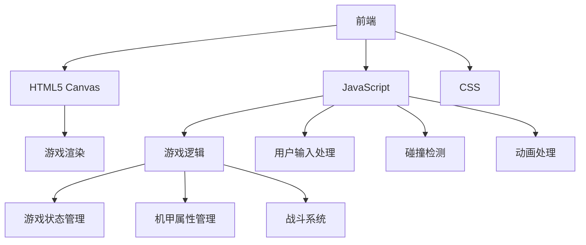
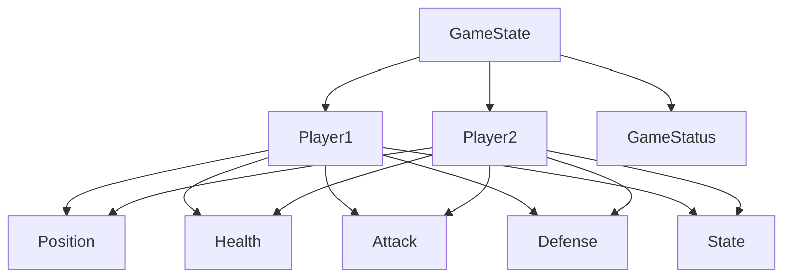

## 1. Architecture Design

## 2. Technology Description
- 前端：纯HTML5 + CSS + JavaScript
- 初始化工具：无需特殊初始化工具
- 后端：无（游戏逻辑完全在前端处理）
- 数据库：无（游戏状态仅在内存中存储）

## 3. Route Definitions
| 路由 | 目的 |
|-------|---------|
| / | 游戏主页 |
| /game | 游戏界面 |
| /end | 游戏结束界面 |

## 4. API Definitions (Not Applicable)
- 本游戏为纯前端游戏，无后端API调用

## 5. Server Architecture Diagram (Not Applicable)
- 本游戏为纯前端游戏，无服务器架构

## 6. Data Model
### 6.1 Data Model Definition

### 6.2 Data Definition Language (Not Applicable)
- 本游戏为纯前端游戏，无数据库操作